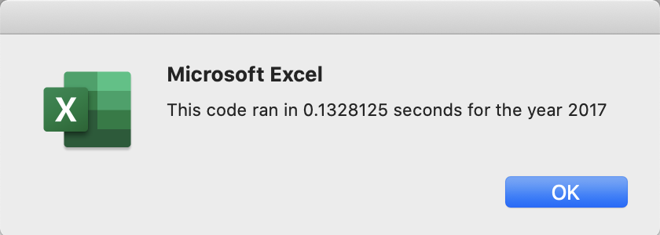
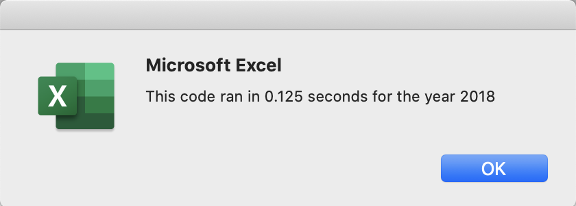

# Stock-analysis

## Overview of Project

Steve, a recent finance graduate wanted to perform analysis on green energy stocks in order to help his parents diversify their investment portfolio who were interested to invest in green energy stocks. Steve's parents so far only invested in DQ. To give other recommendations to his parents Steve wanted to find two key kPI's in 2017 and 2018 for green energy stocks which were Total Daily Volume, that measures how frequently the stocks were traded and their Net Return.  

In order to help Steve analyze and find these KPI's for green energy stocks, a sample data set of 12 stocks containing various hsitorical measures for such green stocks in 2017 and 2018 was utilized. The Total Daily Volume and Net Return was calculated for each of the Green Energy stocks in the sample data set using VBA in Excel to automate and calculate the KPI's accurately. However, Steve now plans to use the same code to analyze the entire stock market which will have a lot more stocks than just the sample size of 12 that was initially analyzed. In order to make the run time for the code shorter to analye the entire stock market, the intital code written was refactored. This report analyzes the observations in run time of the new refactored code vs the old code. 
## Results

Here are the key findings from the analysis in 2017 and 2018 after the code was refactored.  

### Green Stock Performance in 2017

From our analysis on Green Stocks in 2017 we can observe overall that it was a good year to invest in green energy stocks. Of the 12 stocks we analyzed, we can see that 11 had a positive return. DQ was the most successful, as it had a return of 199.4% eventhough it was traded less frequently. Intitally when we wrote our VBA script, it had a total run time of 0.63 seconds for analysis on all Stocks in 2017. 

However, after we refactored the code to just one for loop to loop through all the rows to get each ticker volume and the difference in starting and ending price. the run time was reduced to only 0.13 seconds. When we have more stocks to analyze and a bigger data set, this could help a lot to make the calculations faster. 

### Green Stock Performance in 2018

Our analysis in 2018 shows that most of the green stocks performed poorly. Out of the 12 stocks we analyzed we could only find two stocks that had a positive net retun in 2018. DQ also performed poor in 2018 with a negative return of -62.6%. The only stock that performed well was RUN. Our initial code took 0.66 seconds to run. After the code was refactored and commited, it only took 0.125 seconds to exceute and give us the results making our analysis faster. 

### Analysis of Outcomes Based on Goals

From our analyis we can conclude that refactoring the code did reduce the run time significantly both in 2017 and 2018. In 2017 the run time reduced from 0.63 seconds to just 0.13 seconds and in 2018 from 0.66 seconds to just 0.125 seconds. In general refactoring the codes improves the performance or run time as well as understand the code better and solve bugs faster. However, it does take investment of time to refactor code. 

Furthermore, in our VBA script we created a variable tickerIndex for iterating all the rows and just utilized one for loop to run for our calulations making the code more design friendly and faster. This will help Steve a lot when he decides to use this code to analyze the entire stock market. However, refactoring did make the code a bit more complex and could be hard for someone to understand it fully.
